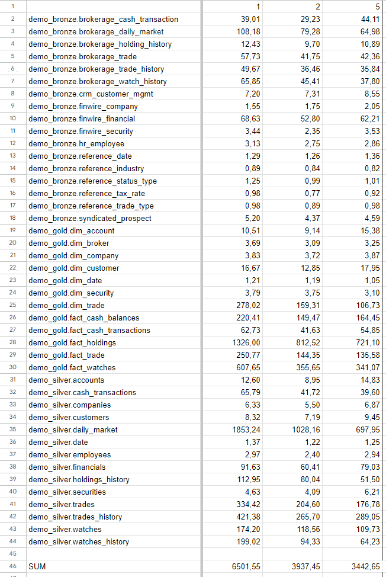

# Phase 2 b

0. The goal of phase 2b is to perform benchmarking/scalability tests of sample three-tier lakehouse solution.

1. In main.tf, change machine_type at:

    ```terraform
    module "dataproc" {
        depends_on   = [module.vpc]
        source       = "github.com/bdg-tbd/tbd-workshop-1.git?ref=v1.0.36/modules/dataproc"
        project_name = var.project_name
        region       = var.region
        subnet       = module.vpc.subnets[local.notebook_subnet_id].id
        machine_type = "e2-standard-2"
    }
    ```

    and substitute "e2-standard-2" with "e2-standard-4".

2. If needed request to increase cpu quotas (e.g. to 30 CPUs):

    <https://console.cloud.google.com/apis/api/compute.googleapis.com/quotas?project=tbd-2023z-9918>

3. Using tbd-tpc-di notebook perform dbt run with different number of executors, i.e., 1, 2, and 5, by changing:

    ```terraform
    "spark.executor.instances": "2"
    ```

    in profiles.yml.

4. In the notebook, collect console output from dbt run, then parse it and retrieve total execution time and execution times of processing each model. Save the results from each number of executors.

    Table of times for 1,2 and 5 executors:

    

5. Analyze the performance and scalability of execution times of each model. Visualize and discuss the final results.

    Total times for each number of executors:

    

    The difference in the sum of processing times between 1 and 2 executors is much greater than between 2 and 5. The time is shorter, but not enough to make it worth it, because the cost increases much faster.

    Times per model for each number of executors:

    

    The detailed chart shows that the largest performance increase when increasing the number of executors is achieved for those tasks that are the longest. The increase for short tasks is reduced or even unnoticeable. This may be due to the fact that in the case of short tasks, the task initialization time dominates the time of the actual computation, so increasing the number of executors will not speed up the process.
