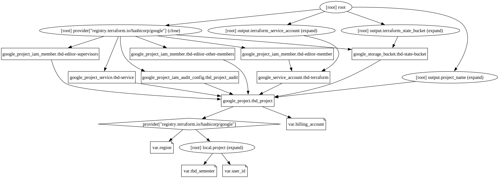
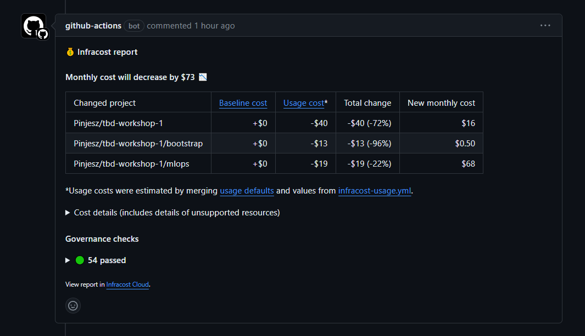

IMPORTANT ❗ ❗ ❗ Please remember to destroy all the resources after each work session. You can recreate infrastructure by creating new PR and merging it to master.


1. Authors:

   gr-3

   <https://github.com/Pinjesz/tbd-workshop-1>

3. Follow all steps in README.md.

4. Select your project and set budget alerts on 5%, 25%, 50%, 80% of 50$ (in cloud console -> billing -> budget & alerts -> create buget; unclick discounts and promotions&others while creating budget).

  

5. From avaialble Github Actions select and run destroy on main branch.

6. Create new git branch and:
    1. Modify tasks-phase1.md file.

    2. Create PR from this branch to **YOUR** master and merge it to make new release.

   

7. Analyze terraform code. Play with terraform plan, terraform graph to investigate different modules.

    data-pipeline module sets up GCP infrastructure for data processing and storage. The module automates bucket creation, access role assignment, and code file uploads. It includes:

    - Local Variables: Simplify configuration by splitting and extracting values.
    - Google Storage Buckets: Create buckets for code and data, enabling versioning and preventing public access.
    - Google Storage Bucket IAM Members: Assign roles to service accounts for bucket access.
    - Google Storage Bucket Objects: Upload specific code files to designated bucket locations.

    

    ***describe one selected module and put the output of terraform graph for this module here***

8. Reach YARN UI
    

    ```sh
    export PROJECT=tbd-2024l-303760
    export HOSTNAME=tbd-cluster-m
    export ZONE=europe-west1-d
    export PORT=8088

    gcloud compute ssh ${HOSTNAME} \
    --project=${PROJECT} --zone=${ZONE}  -- \
    -D ${PORT} -N
    ```

   ***place the command you used for setting up the tunnel, the port and the screenshot of YARN UI here***

9. Draw an architecture diagram (e.g. in draw.io) that includes:
    1. VPC topology with service assignment to subnets
    2. Description of the components of service accounts
    3. List of buckets for disposal
    4. Description of network communication (ports, why it is necessary to specify the host for the driver) of Apache Spark running from Vertex AI Workbech

    ***place your diagram here***

10. Create a new PR and add costs by entering the expected consumption into Infracost
For all the resources of type: `google_artifact_registry`, `google_storage_bucket`, `google_service_networking_connection`
create a sample usage profiles and add it to the Infracost task in CI/CD pipeline. Usage file [example](https://github.com/infracost/infracost/blob/master/infracost-usage-example.yml)

   [File with expected consumption](https://github.com/Pinjesz/tbd-workshop-1/blob/phase1-tasks/infracost-usage.yml)

   ***place the screenshot from infracost output here***
     

11. Create a BigQuery dataset and an external table using SQL

```sh
$ bq mk dataset
$ bq mk --table --external_table_definition=@ORC=gs://cloud-samples-data/bigquery/us-states/us-states.orc dataset.table1
$ bq show dataset.table1

   Table tbd-2024l-303760:dataset.table1

    Last modified           Schema            Type     Total URIs   Expiration   Labels
  ----------------- ---------------------- ---------- ------------ ------------ --------
  15 Apr 18:35:15   |- name: string        EXTERNAL   1
                    |- post_abbr: string
 ```

***place the code and output here***

***why does ORC not require a table schema?***

ORC (Optimized Row Columnar) is a columnar storage format for large datasets in Hadoop. In BigQuery, when you create an external table with an ORC file, schema info is embedded in the file, so you don't need to specify it separately. BigQuery can infer schema from the ORC file's metadata, simplifying table creation in Terraform.

12.  Start an interactive session from Vertex AI workbench:

  

13.  Find and correct the error in spark-job.py

  The path in variable DATA_BUCKET did not exist, it cause the error:

  

  After changing the variable to DATA_BUCKET = "gs://tbd-2024l-303760-data/data/shakespeare/"

  

14.  Additional tasks using Terraform:

    1. Add support for arbitrary machine types and worker nodes for a Dataproc cluster and JupyterLab instance

   <https://github.com/Pinjesz/tbd-workshop-1/commit/16fc51d81e6dc769db94f3564f94bb40b7706b58>

    2. Add support for preemptible/spot instances in a Dataproc cluster

   <https://github.com/Pinjesz/tbd-workshop-1/commit/26a55156cb04bf71c003b22668045bc4b996b10a>

    3. Perform additional hardening of Jupyterlab environment, i.e. disable sudo access and enable secure boot

   <https://github.com/Pinjesz/tbd-workshop-1/commit/3916d1a9df4fa78a610eef01931e368ef380d666)>

    4. (Optional) Get access to Apache Spark WebUI

    ***place the link to the modified file and inserted terraform code***
